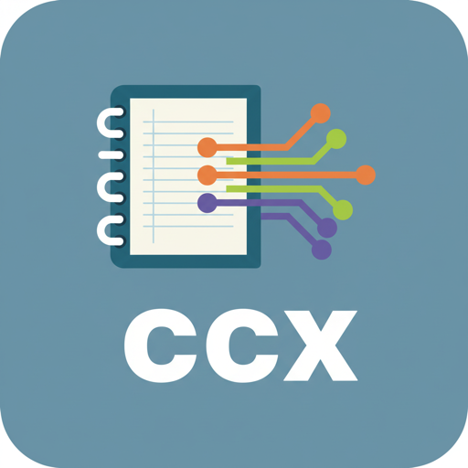

<p align="center">
  
</p>

# ccx-context-system


[](https://code.claude.com/docs/en/plugins)

A personal Claude Code **plugin marketplace** carrying [`ccx`](plugins/ccx/README.md) — the
portable scratch-notebook context-management core (per-thread `STATE.md` handoff docs + a
compiled, parallel-session-safe `INDEX.md` dashboard).

## Install into a project

```
/plugin marketplace add shck-dev/ccx-context-system   # or a local clone path
/plugin install ccx@ccx-context-system
```

Then in any session: `/ccx:start-thread`, `/ccx:save-state`, `/ccx:tidy-scratch`.

**Prerequisite:** `bun` on PATH (all bundled scripts/hooks run under bun, regardless of the
project's own language).

## Dev loop

- Edit plugin files → `/plugin marketplace update ccx-context-system` (or restart the session).
- Try changes in one session only: `claude --plugin-dir ./plugins/ccx`.
- Validate structure: `claude plugin validate ./plugins/ccx` (and `claude plugin validate .`).
- Tests: `bun tests/run-tests.ts` — application-scenario harness against fixture non-Node
  projects (stock + custom config), covering every script and both hooks.
